# Sinchon ICPC Camp ERD
> Generated by [`prisma-markdown`](https://github.com/samchon/prisma-markdown)

- [default](#default)

## default

```mermaid
erDiagram
"BATCH_DEFINITION" {
  Int BATCH_DEFINITION_NO PK
  String BATCH_DEFINITION_NAME
  String BATCH_DEFINITION_CRON
  String BATCH_DEFINITION_DESCRIPTION
  DateTime BATCH_DEFINITION_CREATED_AT
  DateTime BATCH_DEFINITION_UPDATED_AT
  DateTime BATCH_DEFINITION_DELETED_AT "nullable"
}
"BATCH_INSTANCE" {
  Int BATCH_INSTANCE_NO PK
  Int BATCH_DEFINITION_NO FK
  String BATCH_INSTANCE_STATE
  DateTime BATCH_INSTANCE_CREATED_AT
  DateTime BATCH_INSTANCE_UPDATED_AT "nullable"
  DateTime BATCH_INSTANCE_STARTED_AT "nullable"
  DateTime BATCH_INSTANCE_FINISHED_AT "nullable"
  Int BATCH_INSTANCE_ELAPSED_TIME "nullable"
  Json BATCH_INSTANCE_DATA "nullable"
  String BATCH_INSTANCE_ERROR_CODE "nullable"
  String BATCH_INSTANCE_ERROR_MESSAGE "nullable"
}
"JOB_DEFINITION" {
  Int JOB_DEFINITION_NO PK
  String JOB_DEFINITION_NAME UK
  String JOB_DEFINITION_DESCRIPTION
  DateTime JOB_DEFINITION_CREATED_AT
  DateTime JOB_DEFINITION_UPDATED_AT
}
"JOB_STEP" {
  Int JOB_STEP_NO PK
  Int JOB_STEP_ORDER
  String JOB_STEP_NAME
  String JOB_STEP_DESCRIPTION
  DateTime JOB_STEP_CREATED_AT
  DateTime JOB_STEP_UPDATED_AT
  Int JOB_DEFINITION_NO FK
}
"JOB_INSTANCE" {
  Int JOB_NO PK
  String JOB_UUID
  String JOB_NAME
  String JOB_STEP
  Int BATCH_INSTANCE_NO "nullable"
  DateTime JOB_CREATED_AT
  DateTime JOB_UPDATED_AT
  DateTime JOB_STARTED_AT
  DateTime JOB_FINISHED_AT "nullable"
  Int JOB_ELAPSED_TIME "nullable"
  String JOB_STATE
  Json JOB_REQUEST "nullable"
  Json JOB_RESULT "nullable"
  String JOB_ERROR_CODE "nullable"
  String JOB_ERROR_MESSAGE "nullable"
}
"PROBLEM_V2" {
  Int PROBLEM_V2_NO PK
  String PROBLEM_V2_UUID UK
  String PROBLEM_V2_TITLE
  Int PROBLEM_V2_LEVEL
  String PROBLEM_V2_LEVEL_TEXT
  Float PROBLEM_V2_ANSWER_RATE
  Int PROBLEM_V2_SUBMIT_COUNT
  Int PROBLEM_V2_TIMEOUT
  Int PROBLEM_V2_MEMORY_LIMIT
  Int PROBLEM_V2_ANSWER_COUNT
  Int PROBLEM_V2_ANSWER_PEOPLE_COUNT
  String PROBLEM_V2_SOURCE
  String PROBLEM_V2_SOURCE_URL
  String PROBLEM_V2_SOURCE_ID
  String PROBLEM_V2_CONTENT
  String PROBLEM_V2_LIMIT "nullable"
  String PROBLEM_V2_HINT "nullable"
  String PROBLEM_V2_SUB_TASK "nullable"
  String PROBLEM_V2_INPUT "nullable"
  String PROBLEM_V2_OUTPUT "nullable"
  String PROBLEM_V2_PROTOCOL "nullable"
  String PROBLEM_V2_ETC "nullable"
  Boolean PROBLEM_V2_ADDITIONAL_TIME_ALLOWED
  Boolean PROBLEM_V2_IS_SPECIAL_JUDGE
  Boolean PROBLEM_V2_IS_SUB_TASK
  Boolean PROBLEM_V2_IS_FUNCTION
  Boolean PROBLEM_V2_IS_INTERACTIVE
  Boolean PROBLEM_V2_IS_TWO_STEP
  Boolean PROBLEM_V2_IS_CLASS
  DateTime PROBLEM_V2_CREATED_AT
  DateTime PROBLEM_V2_UPDATED_AT
}
"PROBLEM_V2_TYPE" {
  Int PROBLEM_V2_TYPE_NO PK
  String PROBLEM_V2_TYPE_NAME
  String PROBLEM_V2_UUID FK
}
"PROBLEM_V2_INPUT_OUTPUT" {
  Int PROBLEM_V2_INPUT_OUTPUT_NO PK
  Int PROBLEM_V2_INPUT_OUTPUT_ORDER
  String PROBLEM_V2_INPUT_OUTPUT_INPUT
  String PROBLEM_V2_INPUT_OUTPUT_OUTPUT
  String PROBLEM_V2_INPUT_OUTPUT_CONTENT "nullable"
  DateTime PROBLEM_V2_INPUT_OUTPUT_CREATED_AT
  DateTime PROBLEM_V2_INPUT_OUTPUT_UPDATED_AT
  String PROBLEM_V2_UUID FK
}
"USER" {
  Int USER_NO PK
  String USER_UUID UK
  String USER_EMAIL
  String USER_NAME
  String USER_PROFILE_PHOTO
  DateTime USER_REGISTERED_DATE
  DateTime USER_LAST_LOGIN_DATE
  UserState USER_STATE
  Boolean USER_EMAIL_VERIFIED
  DateTime USER_CREATED_AT
  DateTime USER_UPDATED_AT
  DateTime USER_LOGINED_AT
}
"USER_OAUTH" {
  Int USER_NO FK
  String USER_OAUTH_PROVIDER
  String USER_OAUTH_ID
  Boolean USER_OAUTH_IS_ACTIVE
  DateTime USER_OAUTH_CREATED_AT
  DateTime USER_OAUTH_UPDATED_AT
}
"USER_SOCIAL" {
  String USER_SOCIAL_PROVIDER
  Int USER_NO FK
  String USER_SOCIAL_CONTENT
  DateTime USER_SOCIAL_CREATED_AT
  DateTime USER_SOCIAL_UPDATED_AT
}
"PROBLEM" {
  Int PROBLEM_NO PK
  String PROBLEM_UUID UK
  Boolean PROBLEM_IS_SPECIAL_JUDGE
  String PROBLEM_SOURCE
  String PROBLEM_SOURCE_ID
  String PROBLEM_SOURCE_URL
  String PROBLEM_TITLE
  Int PROBLEM_LEVEL
  String PROBLEM_LEVEL_TEXT
  DateTime PROBLEM_REGISTERED_DATE
  DateTime PROBLEM_UPDATED_DATE
  String PROBLEM_INPUT
  String PROBLEM_OUTPUT
  String PROBLEM_HINT
  String PROBLEM_LIMIT
  Int PROBLEM_ANSWER_COUNT
  Int PROBLEM_ANSWER_RATE
  Int PROBLEM_ANSWER_PEOPLE_COUNT
  Int PROBLEM_SUBMIT_COUNT
  Int PROBLEM_TIMEOUT
  Int PROBLEM_MEMORY_LIMIT
  DateTime PROBLEM_CREATED_AT
  DateTime PROBLEM_UPDATED_AT
}
"PROBLEM_CONTENT" {
  String PROBLEM_CONTENT
  String PROBLEM_CONTENT_TYPE
  Int PROBLEM_CONTENT_ORDER
  Int PROBLEM_NO FK
}
"PROBLEM_CONTENT_CELL" {
  Int PROBLEM_CONTENT_CELL_NO PK
  Boolean PROBLEM_CONTENT_CELL_IS_HEADER
  String PROBLEM_CONTENT_CELL_CONTENT
  Int PROBLEM_CONTENT_CELL_ROW_INDEX
  Int PROBLEM_CONTENT_CELL_COL_INDEX
  Int PROBLEM_NO FK
  Int PROBLEM_CONTENT_ORDER
}
"PROBLEM_TYPE" {
  String PROBLEM_TYPE_NAME
  Int PROBLEM_NO FK
}
"PROBLEM_INPUT_OUTPUT" {
  Int PROBLEM_NO FK
  Int PROBLEM_INPUT_OUTPUT_ORDER
  String PROBLEM_INPUT
  String PROBLEM_OUTPUT
}
"USER_PROBLEM_STATE" {
  Int userNo FK
  Int problemNo FK
  Int state
}
"ProblemReport" {
  Int userNo FK
  Int problemNo FK
  Int PROBLEM_REPORT_NO PK
  String PROBLEM_REPORT_TITLE
  String PROBLEM_REPORT_CONTENT
  DateTime createdAt
  ProblemReportState state
}
"ProblemCollectionLog" {
  Int PROBLEM_COLLECTION_LOG_NO PK
  Int USER_NO FK
  DateTime PROBLEM_COLLECTION_LOG_CREATED_AT
  String PROBLEM_COLLECTION_LOG_URL
  String PROBLEM_COLLECTION_LOG_STATE
  String PROBLEM_COLLECTION_LOG_CAUSE "nullable"
}
"CodeSetting" {
  Int USER_CODE_SETTING_NO PK
  Int USER_NO UK
  Int CODE_FONT_SIZE
  Int CODE_PROBLEM_CONTENT_RATE
  String CODE_THEME
  Int CODE_TAB_SIZE
  String CODE_LINE_NUMBER
  String CODE_DEFAULT_LANGUAGE
  DateTime createdAt
  DateTime updatedAt
}
"CODE_DEFAULT_TEMPLATE" {
  Int CODE_DEFAULT_TEMPLATE_NO PK
  Int CODE_TEMPLATE_NO
  Int USER_NO
  String CODE_DEFAULT_TEMPLATE_LANGUAGE
}
"CODE_TEMPLATE" {
  Int CODE_TEMPLATE_NO PK
  String CODE_TEMPLATE_UUID UK
  Int USER_NO
  String CODE_TEMPLATE_NAME
  String CODE_TEMPLATE_LANGUAGE
  String CODE_TEMPLATE_CONTENT
  DateTime CODE_TEMPLATE_CREATED_AT
  DateTime CODE_TEMPLATE_UPDATED_AT
  String CODE_TEMPLATE_DESCRIPTION
}
"PROBLEM_CODE" {
  Int PROBLEM_CODE_NO PK
  Int USER_NO UK
  Int PROBLEM_NO
  String PROBLEM_CODE_LANGUAGE
  String PROBLEM_CODE_CONTENT
  DateTime PROBLEM_CODE_CREATED_AT
  DateTime PROBLEM_CODE_UPDATED_AT
}
"BATCH_INSTANCE" }o--|| "BATCH_DEFINITION" : batchDefinition
"JOB_STEP" }o--|| "JOB_DEFINITION" : jobDefinition
"PROBLEM_V2_TYPE" }o--|| "PROBLEM_V2" : problem
"PROBLEM_V2_INPUT_OUTPUT" }o--|| "PROBLEM_V2" : problem
"USER_OAUTH" }o--|| "USER" : User
"USER_SOCIAL" }o--|| "USER" : User
"PROBLEM_CONTENT" }o--|| "PROBLEM" : Problem
"PROBLEM_CONTENT_CELL" }o--|| "PROBLEM_CONTENT" : ProblemContent
"PROBLEM_TYPE" }o--|| "PROBLEM" : problem
"PROBLEM_INPUT_OUTPUT" }o--|| "PROBLEM" : Problem
"USER_PROBLEM_STATE" }o--|| "USER" : User
"USER_PROBLEM_STATE" }o--|| "PROBLEM" : Problem
"ProblemReport" }o--|| "USER" : User
"ProblemReport" }o--|| "PROBLEM" : Problem
"ProblemCollectionLog" }o--|| "USER" : User
```

### `BATCH_DEFINITION`

**Properties**
  - `BATCH_DEFINITION_NO`: 
  - `BATCH_DEFINITION_NAME`: 
  - `BATCH_DEFINITION_CRON`: 
  - `BATCH_DEFINITION_DESCRIPTION`: 
  - `BATCH_DEFINITION_CREATED_AT`: 
  - `BATCH_DEFINITION_UPDATED_AT`: 
  - `BATCH_DEFINITION_DELETED_AT`: 

### `BATCH_INSTANCE`

**Properties**
  - `BATCH_INSTANCE_NO`: 
  - `BATCH_DEFINITION_NO`: 
  - `BATCH_INSTANCE_STATE`: 
  - `BATCH_INSTANCE_CREATED_AT`: 
  - `BATCH_INSTANCE_UPDATED_AT`: 
  - `BATCH_INSTANCE_STARTED_AT`: 
  - `BATCH_INSTANCE_FINISHED_AT`: 
  - `BATCH_INSTANCE_ELAPSED_TIME`: 
  - `BATCH_INSTANCE_DATA`: 
  - `BATCH_INSTANCE_ERROR_CODE`: 
  - `BATCH_INSTANCE_ERROR_MESSAGE`: 

### `JOB_DEFINITION`

**Properties**
  - `JOB_DEFINITION_NO`: 
  - `JOB_DEFINITION_NAME`: 
  - `JOB_DEFINITION_DESCRIPTION`: 
  - `JOB_DEFINITION_CREATED_AT`: 
  - `JOB_DEFINITION_UPDATED_AT`: 

### `JOB_STEP`

**Properties**
  - `JOB_STEP_NO`: 
  - `JOB_STEP_ORDER`: 
  - `JOB_STEP_NAME`: 
  - `JOB_STEP_DESCRIPTION`: 
  - `JOB_STEP_CREATED_AT`: 
  - `JOB_STEP_UPDATED_AT`: 
  - `JOB_DEFINITION_NO`: 

### `JOB_INSTANCE`

**Properties**
  - `JOB_NO`: 
  - `JOB_UUID`: 
  - `JOB_NAME`: 
  - `JOB_STEP`: 
  - `BATCH_INSTANCE_NO`: 
  - `JOB_CREATED_AT`: 
  - `JOB_UPDATED_AT`: 
  - `JOB_STARTED_AT`: 
  - `JOB_FINISHED_AT`: 
  - `JOB_ELAPSED_TIME`: 
  - `JOB_STATE`: 
  - `JOB_REQUEST`: 
  - `JOB_RESULT`: 
  - `JOB_ERROR_CODE`: 
  - `JOB_ERROR_MESSAGE`: 

### `PROBLEM_V2`

**Properties**
  - `PROBLEM_V2_NO`: 
  - `PROBLEM_V2_UUID`: 
  - `PROBLEM_V2_TITLE`: 
  - `PROBLEM_V2_LEVEL`: 
  - `PROBLEM_V2_LEVEL_TEXT`: 
  - `PROBLEM_V2_ANSWER_RATE`: 
  - `PROBLEM_V2_SUBMIT_COUNT`: 
  - `PROBLEM_V2_TIMEOUT`: 
  - `PROBLEM_V2_MEMORY_LIMIT`: 
  - `PROBLEM_V2_ANSWER_COUNT`: 
  - `PROBLEM_V2_ANSWER_PEOPLE_COUNT`: 
  - `PROBLEM_V2_SOURCE`: 
  - `PROBLEM_V2_SOURCE_URL`: 
  - `PROBLEM_V2_SOURCE_ID`: 
  - `PROBLEM_V2_CONTENT`: 
  - `PROBLEM_V2_LIMIT`: 
  - `PROBLEM_V2_HINT`: 
  - `PROBLEM_V2_SUB_TASK`: 
  - `PROBLEM_V2_INPUT`: 
  - `PROBLEM_V2_OUTPUT`: 
  - `PROBLEM_V2_PROTOCOL`: 
  - `PROBLEM_V2_ETC`: 
  - `PROBLEM_V2_ADDITIONAL_TIME_ALLOWED`: 
  - `PROBLEM_V2_IS_SPECIAL_JUDGE`: 
  - `PROBLEM_V2_IS_SUB_TASK`: 
  - `PROBLEM_V2_IS_FUNCTION`: 
  - `PROBLEM_V2_IS_INTERACTIVE`: 
  - `PROBLEM_V2_IS_TWO_STEP`: 
  - `PROBLEM_V2_IS_CLASS`: 
  - `PROBLEM_V2_CREATED_AT`: 
  - `PROBLEM_V2_UPDATED_AT`: 

### `PROBLEM_V2_TYPE`

**Properties**
  - `PROBLEM_V2_TYPE_NO`: 
  - `PROBLEM_V2_TYPE_NAME`: 
  - `PROBLEM_V2_UUID`: 

### `PROBLEM_V2_INPUT_OUTPUT`

**Properties**
  - `PROBLEM_V2_INPUT_OUTPUT_NO`: 
  - `PROBLEM_V2_INPUT_OUTPUT_ORDER`: 
  - `PROBLEM_V2_INPUT_OUTPUT_INPUT`: 
  - `PROBLEM_V2_INPUT_OUTPUT_OUTPUT`: 
  - `PROBLEM_V2_INPUT_OUTPUT_CONTENT`: 
  - `PROBLEM_V2_INPUT_OUTPUT_CREATED_AT`: 
  - `PROBLEM_V2_INPUT_OUTPUT_UPDATED_AT`: 
  - `PROBLEM_V2_UUID`: 

### `USER`

**Properties**
  - `USER_NO`: 
  - `USER_UUID`: 
  - `USER_EMAIL`: 
  - `USER_NAME`: 
  - `USER_PROFILE_PHOTO`: 
  - `USER_REGISTERED_DATE`: 
  - `USER_LAST_LOGIN_DATE`: 
  - `USER_STATE`: 
  - `USER_EMAIL_VERIFIED`: 
  - `USER_CREATED_AT`: 
  - `USER_UPDATED_AT`: 
  - `USER_LOGINED_AT`: 

### `USER_OAUTH`

**Properties**
  - `USER_NO`: 
  - `USER_OAUTH_PROVIDER`: 
  - `USER_OAUTH_ID`: 
  - `USER_OAUTH_IS_ACTIVE`: 
  - `USER_OAUTH_CREATED_AT`: 
  - `USER_OAUTH_UPDATED_AT`: 

### `USER_SOCIAL`

**Properties**
  - `USER_SOCIAL_PROVIDER`: 
  - `USER_NO`: 
  - `USER_SOCIAL_CONTENT`: 
  - `USER_SOCIAL_CREATED_AT`: 
  - `USER_SOCIAL_UPDATED_AT`: 

### `PROBLEM`

**Properties**
  - `PROBLEM_NO`: 
  - `PROBLEM_UUID`: 
  - `PROBLEM_IS_SPECIAL_JUDGE`: 
  - `PROBLEM_SOURCE`: 
  - `PROBLEM_SOURCE_ID`: 
  - `PROBLEM_SOURCE_URL`: 
  - `PROBLEM_TITLE`: 
  - `PROBLEM_LEVEL`: 
  - `PROBLEM_LEVEL_TEXT`: 
  - `PROBLEM_REGISTERED_DATE`: 
  - `PROBLEM_UPDATED_DATE`: 
  - `PROBLEM_INPUT`: 
  - `PROBLEM_OUTPUT`: 
  - `PROBLEM_HINT`: 
  - `PROBLEM_LIMIT`: 
  - `PROBLEM_ANSWER_COUNT`: 
  - `PROBLEM_ANSWER_RATE`: 
  - `PROBLEM_ANSWER_PEOPLE_COUNT`: 
  - `PROBLEM_SUBMIT_COUNT`: 
  - `PROBLEM_TIMEOUT`: 
  - `PROBLEM_MEMORY_LIMIT`: 
  - `PROBLEM_CREATED_AT`: 
  - `PROBLEM_UPDATED_AT`: 

### `PROBLEM_CONTENT`

**Properties**
  - `PROBLEM_CONTENT`: 
  - `PROBLEM_CONTENT_TYPE`: 
  - `PROBLEM_CONTENT_ORDER`: 
  - `PROBLEM_NO`: 

### `PROBLEM_CONTENT_CELL`

**Properties**
  - `PROBLEM_CONTENT_CELL_NO`: 
  - `PROBLEM_CONTENT_CELL_IS_HEADER`: 
  - `PROBLEM_CONTENT_CELL_CONTENT`: 
  - `PROBLEM_CONTENT_CELL_ROW_INDEX`: 
  - `PROBLEM_CONTENT_CELL_COL_INDEX`: 
  - `PROBLEM_NO`: 
  - `PROBLEM_CONTENT_ORDER`: 

### `PROBLEM_TYPE`

**Properties**
  - `PROBLEM_TYPE_NAME`: 
  - `PROBLEM_NO`: 

### `PROBLEM_INPUT_OUTPUT`

**Properties**
  - `PROBLEM_NO`: 
  - `PROBLEM_INPUT_OUTPUT_ORDER`: 
  - `PROBLEM_INPUT`: 
  - `PROBLEM_OUTPUT`: 

### `USER_PROBLEM_STATE`

**Properties**
  - `userNo`: 
  - `problemNo`: 
  - `state`: 

### `ProblemReport`

**Properties**
  - `userNo`: 
  - `problemNo`: 
  - `PROBLEM_REPORT_NO`: 
  - `PROBLEM_REPORT_TITLE`: 
  - `PROBLEM_REPORT_CONTENT`: 
  - `createdAt`: 
  - `state`: 

### `ProblemCollectionLog`

**Properties**
  - `PROBLEM_COLLECTION_LOG_NO`: 
  - `USER_NO`: 
  - `PROBLEM_COLLECTION_LOG_CREATED_AT`: 
  - `PROBLEM_COLLECTION_LOG_URL`: 
  - `PROBLEM_COLLECTION_LOG_STATE`: 
  - `PROBLEM_COLLECTION_LOG_CAUSE`: 

### `CodeSetting`

**Properties**
  - `USER_CODE_SETTING_NO`: 
  - `USER_NO`: 
  - `CODE_FONT_SIZE`: 
  - `CODE_PROBLEM_CONTENT_RATE`: 
  - `CODE_THEME`: 
  - `CODE_TAB_SIZE`: 
  - `CODE_LINE_NUMBER`: 
  - `CODE_DEFAULT_LANGUAGE`: 
  - `createdAt`: 
  - `updatedAt`: 

### `CODE_DEFAULT_TEMPLATE`

**Properties**
  - `CODE_DEFAULT_TEMPLATE_NO`: 
  - `CODE_TEMPLATE_NO`: 
  - `USER_NO`: 
  - `CODE_DEFAULT_TEMPLATE_LANGUAGE`: 

### `CODE_TEMPLATE`

**Properties**
  - `CODE_TEMPLATE_NO`: 
  - `CODE_TEMPLATE_UUID`: 
  - `USER_NO`: 
  - `CODE_TEMPLATE_NAME`: 
  - `CODE_TEMPLATE_LANGUAGE`: 
  - `CODE_TEMPLATE_CONTENT`: 
  - `CODE_TEMPLATE_CREATED_AT`: 
  - `CODE_TEMPLATE_UPDATED_AT`: 
  - `CODE_TEMPLATE_DESCRIPTION`: 

### `PROBLEM_CODE`

**Properties**
  - `PROBLEM_CODE_NO`: 
  - `USER_NO`: 
  - `PROBLEM_NO`: 
  - `PROBLEM_CODE_LANGUAGE`: 
  - `PROBLEM_CODE_CONTENT`: 
  - `PROBLEM_CODE_CREATED_AT`: 
  - `PROBLEM_CODE_UPDATED_AT`: 