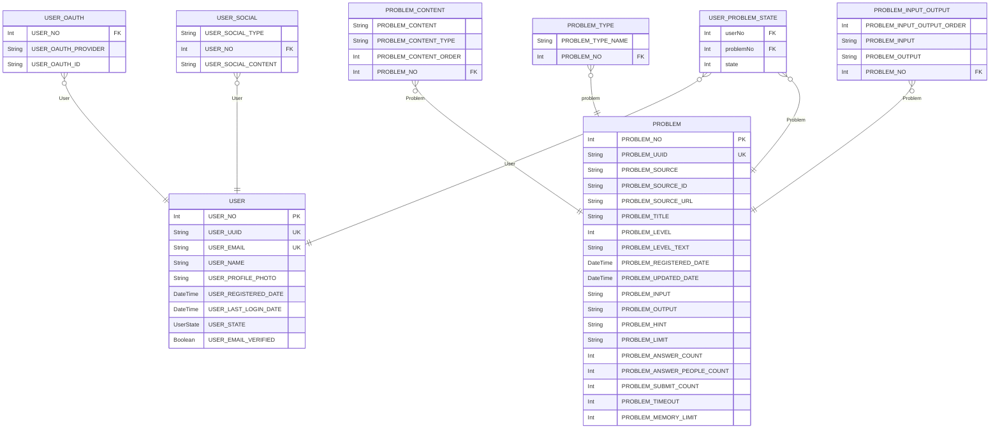

# Sinchon ICPC Camp ERD
> Generated by [`prisma-markdown`](https://github.com/samchon/prisma-markdown)

- [default](#default)

## default

### `USER`

**Properties**
  - `USER_NO`: 
  - `USER_UUID`: 
  - `USER_EMAIL`: 
  - `USER_NAME`: 
  - `USER_PROFILE_PHOTO`: 
  - `USER_REGISTERED_DATE`: 
  - `USER_LAST_LOGIN_DATE`: 
  - `USER_STATE`: 
  - `USER_EMAIL_VERIFIED`: 

### `USER_OAUTH`

**Properties**
  - `USER_NO`: 
  - `USER_OAUTH_PROVIDER`: 
  - `USER_OAUTH_ID`: 

### `USER_SOCIAL`

**Properties**
  - `USER_SOCIAL_TYPE`: 
  - `USER_NO`: 
  - `USER_SOCIAL_CONTENT`: 

### `PROBLEM`

**Properties**
  - `PROBLEM_NO`: 
  - `PROBLEM_UUID`: 
  - `PROBLEM_SOURCE`: 
  - `PROBLEM_SOURCE_ID`: 
  - `PROBLEM_SOURCE_URL`: 
  - `PROBLEM_TITLE`: 
  - `PROBLEM_LEVEL`: 
  - `PROBLEM_LEVEL_TEXT`: 
  - `PROBLEM_REGISTERED_DATE`: 
  - `PROBLEM_UPDATED_DATE`: 
  - `PROBLEM_INPUT`: 
  - `PROBLEM_OUTPUT`: 
  - `PROBLEM_HINT`: 
  - `PROBLEM_LIMIT`: 
  - `PROBLEM_ANSWER_COUNT`: 
  - `PROBLEM_ANSWER_PEOPLE_COUNT`: 
  - `PROBLEM_SUBMIT_COUNT`: 
  - `PROBLEM_TIMEOUT`: 
  - `PROBLEM_MEMORY_LIMIT`: 

### `PROBLEM_CONTENT`

**Properties**
  - `PROBLEM_CONTENT`: 
  - `PROBLEM_CONTENT_TYPE`: 
  - `PROBLEM_CONTENT_ORDER`: 
  - `PROBLEM_NO`: 

### `PROBLEM_TYPE`

**Properties**
  - `PROBLEM_TYPE_NAME`: 
  - `PROBLEM_NO`: 

### `PROBLEM_INPUT_OUTPUT`

**Properties**
  - `PROBLEM_INPUT_OUTPUT_ORDER`: 
  - `PROBLEM_INPUT`: 
  - `PROBLEM_OUTPUT`: 
  - `PROBLEM_NO`: 

### `USER_PROBLEM_STATE`

**Properties**
  - `userNo`: 
  - `problemNo`: 
  - `state`: 